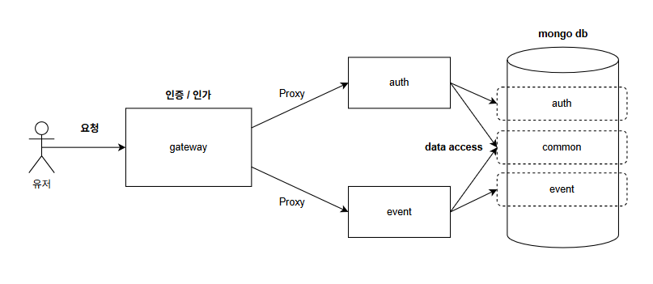

# 메이플스토리 이벤트/보상 관리 플랫폼
- 유저는 조건을 만족하는 이벤트에 대해 보상을 요청하고 자동으로 지급받을 수 있습니다.
- 운영자는 다양한 이벤트와 보상을 정의할 수 있습니다.

<br>

# 설계 관점
- **Monorepo 구조**
  - 각 서비스는 독립적인 Dockerfile 을 가지고 docker-compose 로 실행합니다.
  - libs 디렉터리에는 여러 마이크로서비스에서 공통으로 사용하는 모듈을 모아두고, 각 서비스의 빌드 과정에서 복사하여 참조합니다.
- **이벤트 설계**
  - 이벤트의 조건(condition) 과 보상(reward) 은 각각 별도 컬렉션으로 관리하여, 향후 새로운 항목이 추가되더라도 유연하게 확장할 수 있도록 설계했습니다.
  - 조건 검증 로직에는 Strategy 패턴을 적용해, 이벤트가 늘어날 때마다 검증 코드를 일관되게 유지할 수 있도록 설계했습니다.
- **POST 요청 멱등성 보장**
  - @nestjs/cache-manager를 활용해 고유 식별자를 캐시에 저장하고 동일 식별자의 요청이 재차 들어올 경우, 기존 캐시를 확인해 중복 실행을 차단합니다.
- **API Gateway**
  - 클라이언트로부터 들어오는 모든 요청에서 인증과 인가를 수행하고 검증이 완료된 요청만 내부 각 마이크로서비스로 전달합니다. 

# 개선 포인트
- **마이크로서비스 간 통신 방식 개선**
  - 현재는 API Gateway → 각 마이크로서비스로 HTTP 요청을 전달하고 있지만, gRPC나 TCP 프로토콜 도입을 검토할 수 있습니다.
- **데이터베이스 분리**
  - 현재 하나의 MongoDB 인스턴스 내에서 여러 데이터베이스를 분리하여 사용 중이지만, 향후 서비스별 전용 DB(또는 다른 종류의 DBMS) 도입을 고려할 수 있습니다.
    - 전용 DB 운영 시 서비스 경계에 따른 데이터 소유권이 명확해지고, 읽기/쓰기 부하를 분산하거나 각 서비스에 특화된 DB 엔진을 선택할 수 있는 유연성이 생깁니다.
    - 다만, 분산 트랜잭션 관리나 데이터 일관성을 유지하기 위한 전략 등 보완책이 필요합니다.
- **테스트 코드 도입**
  - 현재는 단위 테스트와 통합 테스트가 없어, 코드 변경 시 리그레션을 방지하기 어렵습니다.
    - CI/CD 파이프라인에 테스트 실행 단계를 추가하면, 배포 전 코드 품질을 자동으로 검증할 수 있습니다.
- 

# 실행 방법
```bash
# 루트 디렉토리에서 실행
docker-compose up --build -d
```
- Gateway Server : http://localhost:3000

# API SPEC
## AUTH
### 1. 유저 등록
| Method | Endpoint                    | Body                                               |
| - |-----------------------------|----------------------------------------------------|
| POST | http://localhost:3000/users | {"email":"user@tmail.ws", "password":"123456"}     |

### 2. 로그인
|  Method | Endpoint                    | Body                                               |Role     |
  | - |-----------------------------|----------------------------------------------------|----------|
| POST | http://localhost:3000/login | {"email":"user@tmail.ws", "password":"123456"}     |USER     | 
| POST | http://localhost:3000/login | {"email":"operator@tmail.ws", "password":"123456"} |OPERATOR | 
| POST | http://localhost:3000/login | {"email":"auditor@tmail.ws", "password":"123456"}  |AUDITOR  | 
| POST | http://localhost:3000/login | {"email":"admin@tmail.ws", "password":"123456"}    |ADMIN    | 

### 3. 유저 수정
| Method | Endpoint                            | Body                                |
|--------|-------------------------------------|-------------------------------------|
| PATCH  | http://localhost:3000/users/:userId | {"password":"1234", "role":"ADMIN"} |

## EVENT
### 1. 이벤트 생성
| Method | Endpoint                     | Body                                                                                                                                                                                             |
|--------|------------------------------|--------------------------------------------------------------------------------------------------------------------------------------------------------------------------------------------------|
| POST   | http://localhost:3000/events | {"code":"FL01", "title":"첫 로그인 이벤트", "startAt":"2025-05-20", "endAt":"2025-11-11", "conditions":[{"type": "LOGIN", "count": 1, "calculation": "COUNT"}], "rewards":["682ab0437a0b041f25a757a2"]} |

### 2. 이벤트 목록 조회
| Method | Endpoint                     |
|--------|------------------------------|
| GET    | http://localhost:3000/events |

### 3. 이벤트 상세 조회
| Method | Endpoint                              |
|--------|---------------------------------------|
| GET    | http://localhost:3000/events/:eventId |

### 4. 이벤트 업데이트
| Method | Endpoint                              | Body                                                                                                                                                                                                  |
|--------|---------------------------------------|-------------------------------------------------------------------------------------------------------------------------------------------------------------------------------------------------------|
| PATCH  | http://localhost:3000/events/:eventId | {"code":"LO3", "title":"기간 내 3일 로그인 이벤트", "startAt":"2025-05-20", "endAt":"2025-11-11", "conditions":[{"type": "LOGIN", "count": 3, "calculation": "COUNT"}], "rewards":["682ab0437a0b041f25a757a2"]} |

### 5. 이벤트 보상 요청
| Method | Endpoint                               |
|--------|----------------------------------------|
| POST   | http://localhost:3000/events/:eventId/claim |

### 6. 이벤트 보상 생성
| Method | Endpoint                      | Body                                                                          |
| - |-------------------------------|-------------------------------------------------------------------------------|
| POST | http://localhost:3000/rewards | {"code":"ITEM001", "label":"아이템지급", "params":{"id":"실제엔티티ID", "count":10000}} |

### 7. 이벤트 보상 목록 조회
| Method | Endpoint                      |
|--------|-------------------------------|
| GET    | http://localhost:3000/rewards |

### 8. 이벤트 보상 상세 조회
| Method | Endpoint                                |
|--------|-----------------------------------------|
| GET    | http://localhost:3000/rewards/:rewardId |

### 9. 이벤트 보상 지급 내역 조회
| Method | Endpoint                              |
|--------|---------------------------------------|
| GET    | http://localhost:3000/rewards/history |


# ER Diagram


# 서비스 플로우
